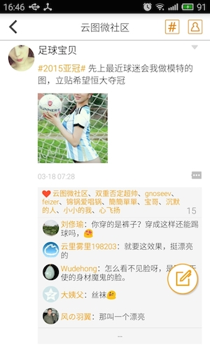
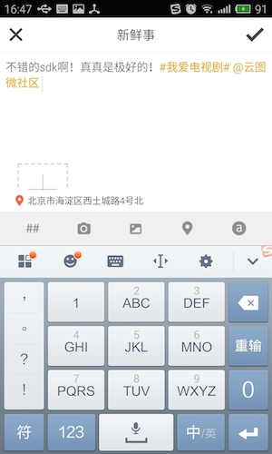
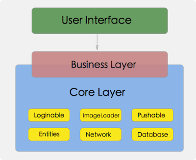
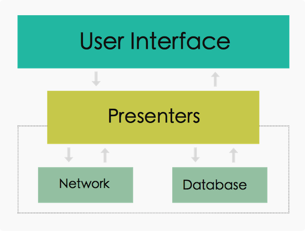

#  友盟微社区 Android SDK
-------

## 目录 

* [一、微社区简介](#intro)
* [二、微社区技术整体架构](#arch)
* [三、微社区UI层架构](#ui_arch)
* [四、报告与修复bug](#report_bug)
* [五、版权声明](#license)

<b id="intro"></b>
## 一、友盟微社区是什么 ？
简单来说，友盟微社区就是一款帮助开发者在应用中快速搭建一个社区（ 类似于新浪微博 ）的产品。在很多应用中，开发商往往都会需要一个用户之间以及用户与开发商之间互动的社区，用户往往又会在社区里选择赞、评论、关注、转发、发帖等各种互动方式。但是开发一个社交系统可不是那么容易的一件事，复杂的用户关系、消息流、服务器架构等等都是棘手的问题，更重要的是大家都是重复地劳动！每个开发商需要这些功能的时候都需要从头开始构建这么一个开发成本很高的社交系统。友盟为了解决这些问题推出了[友盟微社区SDK ](http://dev.umeng.com/wsq/android/sdk-download)这款产品，它可以让你以SDK集成的方式快速的构建一个社区，大大提高了生产力和用户活跃度。

### 1.1 特点

1. UI开源；
2. 可作为SDK嵌入已有应用 ；
3. 可一键生成独立APP；
4. 账户系统、图片加载等核心组件可定制；
5. 先进的anti-spam，自动肃清垃圾信息；


如图1-1、图1-2是云图TV的集成效果。        

|  | |
:---:|:-----:|
| 图1-1 | 图1-2 |

<b id="arch"></b>
## 二、技术架构
从项目结构上来说，友盟微社区SDK可以简单分为如下三层:   

        
图 2-1 层次结构图

* UI层 (User Interface开源)       
UI层对外开放，目的是让用户能够定制友盟微社区的UI效果，使微社区SDK能够很自然的融入到用户的App中。

* UI与业务逻辑层 (Business Layer)    
业务逻辑层会通过一个统一的接口向UI层提供数据数据请求等功能，比如获取缓存的feed、好友列表等，因此业务逻辑层对于用户来说是一个数据操作接口，通过这个接口用户能够与SDK 核心层进行一些数据方面的操作。

* 核心层 (Core Layer)     
核心层则包含了友盟SDK的核心系统抽象，比如账户系统、推送、数据库、网络操作等，这一层对外封闭，用户可以通过一些接口与核心层进行交互。而核心层定义的抽象使得用户可以很方便的实现定制化，即自己实现抽象接口，然后将具体的实现注入到友盟微社区中，从而使自己的子系统替换掉微社区中的默认实现 （下文会给出示例 ）。

友盟微社区SDK层次分明，通过这三个层次的隔离，使得用户既可以自定义最外层的UI效果，也对外隐藏了业务逻辑层、核心层的实现细节。而核心层定义的子系统抽象，使得用户可以注入自己的实现，保证了整个微社区SDK的灵活性、扩展性。   

图2-1显示了友盟微社区SDK是通过不同的层次来分离职责，是一个较为典型的架构形式。对于用户来说，最关心的莫过于可定制化。UI层开放源码，自然可以通过修改代码来实现。其他的定制化用户就需要依赖注入来实现。友盟微社区SDK内部依赖于抽象，而不依赖于具体实现，并且用户可以注入具体实现。也就是说用户可以根据我们的抽象接口实现自己的子系统，然后注入到SDK内部，SDK此时就会使用用户注入的实现，这样就达到了子系统替换的效果，也就是我们说的定制化。

<b id="ui_arch"></b>
## 三、UI层架构
友盟微社区开源部分的UI层代码采用的是MVP架构，关于MVP架构的介绍大家可以参考[MVP在Android平台上的应用](http://www.devtf.cn/?p=567)、[Android中的MVP](http://www.devtf.cn/?p=467)。因此UI层的基础架构如图2-2所示。



UI元素的交互操作都交由Presenter进行处理，在Presenter中包含了具体的业务逻辑，通过Presenter可以进行网络请求、读取数据库，并且最终将结果通过View接口传递给UI。通过MVP模式，使得友盟微社区的耦合性更低，易于扩展。

### 3.1 UI源码结构

|         包名      |       作用       |
|------------------|-----------------|
| com.umeng.comm.core.db.ctrl.impl  | 数据库操作的实现类 [类名不能修改] |
| com.umeng.comm.ui.activities  | 微社区的Activity包 |
| com.umeng.comm.ui.adapters  | 各类集合组件的Adapter |
| com.umeng.comm.ui.adapters.viewholders  | Adapter中对应的ViewHolder |
| com.umeng.comm.ui.anim  | 滚动用户个人信息页面Header的动画包 |
| com.umeng.comm.ui.dialogs  | 微社区内部的一些对话框 |
| com.umeng.comm.ui.emoji  | 评论中使用的emoji表情实现 |
| com.umeng.comm.ui.fragments  | 各个页面的Fragment |
| com.umeng.comm.ui.imagepicker  | 发布Feed时的图片选择器,用户也可以通过自定义ImagePicker实现替换,参考DefaultImagePicker |
| com.umeng.comm.ui.location  | 微社区SDK的定位实现，采用高德定位SDK |
| com.umeng.comm.ui.notifycation  | 发布feed时的消息通知 |
| com.umeng.comm.ui.mvpview  | MVP模式中的View接口 |
| com.umeng.comm.ui.presenter  | MVP模式中的Presenter抽象与实现 |
| com.umeng.comm.ui.utils  | 工具包 |
| com.umeng.comm.ui.utils.textspan  | 在TextView中渲染高亮文本的实现，例如话题名、@的用户名等 |
| com.umeng.comm.ui.widgets  | 微社区中的自定义控件 |

<b id="report_bug"></b>
## 四、报告bug与提交代码
任何产品都不可避免的存在或多或少的bug，因此我们欢迎广大开发者向我们提交bug报告、修复某个bug的代码、重构与架构代码的建议等。

### 4.1 提交bug报告
如果您在使用、测试我们产品的过程中发现了问题，我们欢迎您向我们提交bug报告，但是遵循一定的格式会让我们修复问题的速度变得更快。我们建议的格式如下 : 

```
标题 : 微社区SDK xx版本 bug报告
bug描述 : 在xx场景（比如某个页面、某个操作之下，如果与特定机型相关，则需要添加上机型）下会出现xx异常。

异常log : 在这里完整的贴出有价值的异常log。
```
如果是提交了修复某个bug的代码，我们也希望您带上bug报告，以便我们确定问题所在。

<b id="license"></b>
## 五、版权声明

```
The MIT License (MIT)

Copyright (c) 2014~2015 Umeng.com Limited

Permission is hereby granted, free of charge, to any person obtaining a copy
of this software and associated documentation files (the "Software"), to deal
in the Software without restriction, including without limitation the rights
to use, copy, modify, merge, publish, distribute, sublicense, and/or sell
copies of the Software, and to permit persons to whom the Software is
furnished to do so, subject to the following conditions:

The above copyright notice and this permission notice shall be included in all
copies or substantial portions of the Software.

THE SOFTWARE IS PROVIDED "AS IS", WITHOUT WARRANTY OF ANY KIND, EXPRESS OR
IMPLIED, INCLUDING BUT NOT LIMITED TO THE WARRANTIES OF MERCHANTABILITY,
FITNESS FOR A PARTICULAR PURPOSE AND NONINFRINGEMENT. IN NO EVENT SHALL THE
AUTHORS OR COPYRIGHT HOLDERS BE LIABLE FOR ANY CLAIM, DAMAGES OR OTHER
LIABILITY, WHETHER IN AN ACTION OF CONTRACT, TORT OR OTHERWISE, ARISING FROM,
OUT OF OR IN CONNECTION WITH THE SOFTWARE OR THE USE OR OTHER DEALINGS IN THE
SOFTWARE.

```
