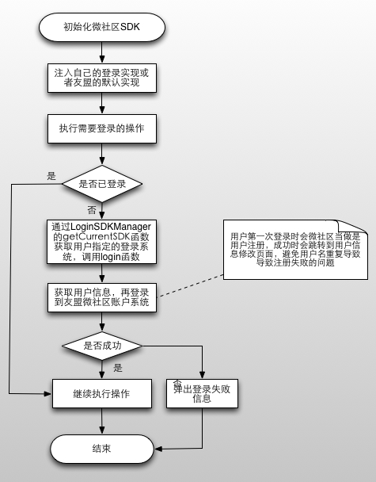

# 友盟微社区SDK Manager设计思路

## 三、友盟微社区的定制化
### 3.1 如何满足定制化 ?
为了更好的让用户定制微社区内部的子系统，例如登录、ImageLoader等，友盟微社区SDK内部定义了一些抽象，比如Loginable、Pushable、ImageLoader来分别代表登录系统接口、推送接口、图片加载接口，每种接口都有一个SDKManager来进行管理。比如管理登录子系统的就是LoginSDKManager，用户可以往这个Manager里面添加、移除具体的登录系统实现，然后通过useThis函数来指定使用某个具体的实现（SDK Manager里面可能有多个实现 ）。结构图如图 3-1所示 。     

     
图 3-1 

SDK Manager是一个泛型类，类型T就代表了接口类型，比如上述的Loginable等。通过泛型我们就可以将这些通用的添加、移除实现等操作抽象化，避免重复代码。代码如下所示:  

```java
public abstract class SDKManager<T> {
	// 泛型Map
    private Map<String, T> mImplMap = new HashMap<String, T>();
    // 要使用的实现的key
    private String mCurrentKey = "";

    public void addImpl(String key, T impl) {
        mImplMap.put(mCurrentKey, impl);
    }

    public void removeImpl(String key) {
        mImplMap.remove(mCurrentKey);
    }

    public void useThis(String key) {
        mCurrentKey = key;
    }

    public T getCurrentSDK() {
        return mImplMap.get(mCurrentKey);
    }
    
    public void addAndUse(T impl) {
        if (impl == null) {
            return;
        }
        mCurrentKey = impl.getClass().getSimpleName();
        mImplMap.put(mCurrentKey, impl);
    }

}
```

代码很简单，就是在SDK Manager内部维护了一个Map，key是用户为这个实现指定的一个字符串值，value就是具体的实现。用户可以通过这个key来移除实现，更常用的是我们需要调用useThis(String key)接口来指定使用某个具体的实现。     

我们并没有直接使用SDKManager，因为它是一个抽象泛型类，因此我们定义了一些子类来对不同的实现进行管理，这些子类都是单例类，例如LoginSDKManager，代码如下所示。     

```java
public final class LoginSDKManager extends SDKManager<Loginable> {
    // 单例对象
    static LoginSDKManager sInstance = new LoginSDKManager();

    private LoginSDKManager() {
    }

    // 获取单例对象
    public static LoginSDKManager getInstance() {
        return sInstance;
    }

}
```

在用户需要对登录系统进行管理时，通过`LoginSDKManager.getInstance()`就可以获取到负责管理登录系统的SDK Manager，此时用户可以通过`addImpl(String key, T impl)`、`useThis(String key)`等接口对登录系统进行管理，这就就可以灵活使用用户自定义的子系统。

### 3.2 示例

下面还是以一个示例来说明问题吧。
在与用户沟通的过程中，我们发现登录模块是用户自定义概率最高的子系统。通常情况下，用户可能有自己的账户系统或者使用了第三方登录( 比如[友盟社会化组件](http://www.umeng.com/social) )，此时用户就不需要友盟微社区SDK中附带的登录实现，完全依赖自己的账户系统或者其他第三方登录SDK来实现一个登录系统。下面我们就以实现登录系统 （ 其他子系统的自定义原理一样 ） 来演示自定义过程。

在开始之前，我们需要对登录的抽象接口Loginable进行了解。代码如下所示:        

```java
public interface Loginable {
    public void login();
    public void logout();
    public boolean isLogined();
}
```

* login() : 登录函数，用户需要在登录成功后将用户信息回调给友盟微社区SDK (具体过程可以参考友盟[微社区集成文档](http://dev.umeng.com/wsq/android/detail-integration#1))；
* logout() : 登出函数，注销用户的登录即可；
* isLogined() : 用户是否登录，返回true表示已登录，否则为未登录。

微社区SDK内部通过抽象了几个简单接口来定义登录模块的功能，用户通过实现这几个函数即可定制自己的登录系统，最后将实现诸如到友盟微社区SDK即可。例如，如果你的应用中已经有了自己的账户系统逻辑，你可以在Loginable的几个函数中通过调用你的账户系统逻辑实现这几个功能；如果你使用了[友盟社会化组件](http://dev.umeng.com/social/android/login-page) ( **注意 : 虽然友盟微社区SDK的登录模块使用的是友盟社会化组件，但它们的jar文件并不是一致的，因此不管你使用其中哪一个实现，都需要更新所有与登录相关的jar文件。** )，那么你可以通过友盟社会化组件的登录、登出功能实现对应的功能，例如你可以在`login()`函数中调用`UMSocialService`对象的`doOauthVerify(Context context , SHARE_MEDIA platform , UMAuthListener listener)`接口来实现登录。

一句话概括就是 : 自定义一个实现了Loginable接口的类，在这个类的各个函数中调用你原有的登录、登出、判断是否已登录的函数来实现对应的功能。实现了登录类之后，通过LoginSDKManager的`addImpl(String key, Loginable impl)`来将该实现注入到友盟微社区SDK中，最后通过LoginSDKManager的`useThis(String key)`函数来指定要使用的登录实现，这个key就是`addImpl(String key, Loginable impl)`中设置的key。


**自定义登录类示例代码如下 :** 

```java
/**
 * 友盟社会化组件的登录实现,这里可以替换成自己的账户系统、第三方登录等，实现几个接口函数即可。
 */
public class SocialLoginImpl implements Loginable {

    @Override
    public void login() {
        // 登录的具体实现，可以调用你自己的登录代码或者第三方SDK的登录函数
    }

    @Override
    public void logout() {
        // 登出的具体实现，可以调用你自己的登录代码或者第三方SDK的登录函数
    }

    @Override
    public boolean isLogined() {
        // 检测是否登录
        return true /* 代码省略 */;
    }

}

```

**注入登录实现 :**      

```java
// 登录系统管理器
LoginSDKManager loginMgr = LoginSDKManager.getInstance() ;
// key
String clzKey = SocialLoginImpl.class.getName() ;
// 注入实现
loginMgr.addImpl(clzKey, new SocialLoginImpl());
// 指定使用的具体实现
loginMgr.useThis(clzKey);
```

为了更简单，这个过程被我们封装到一个函数中，使用的代码最后简化为 :     

```java
// 一行代码搞定！这个函数封装了上述所有的代码。
LoginSDKManager.getInstance().addAndUse(new SocialLoginImpl()) ;
```

通过这几步，登录系统就注入到微社区SDK中了。当友盟微社区需要登录时，微社区SDK就会通过LoginSDKManager的getCurrentSDK()函数获取用户指定的登录实现，然后触发对应的`login()`函数，此时就会执行你的登录流程。登录成功之后，通过`login()`函数的回调listener ( 这个简单示例中没有给出该listener, 具体可参考 [友盟微社区使用已有账户系统](http://dev.umeng.com/wsq/android/detail-integration#1) ) 将用户信息传回给友盟SDK，就完成了整个登录过程。


**登录流程最终如下图所示 :** 

